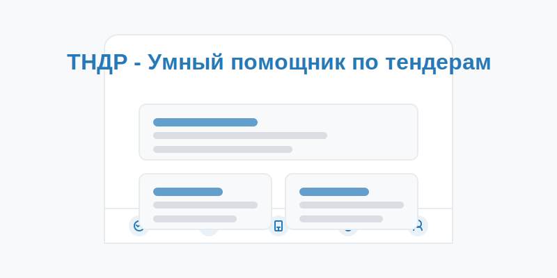

# ТНДР - Умный помощник по тендерам

ТНДР - это мини-приложение для Telegram, которое помогает поставщикам находить наиболее подходящие тендеры, анализировать риски и получать юридическую поддержку.



## Функциональные возможности

1. **Умный поиск и подбор тендеров**
   - ИИ анализирует профиль поставщика и подбирает наиболее подходящие тендеры
   - Предиктивная аналитика прогнозирует будущие возможности

2. **Антикор**
   - ИИ-аналитика отслеживает подозрительные шаблоны в торгах
   - Анализ исторических данных, связей между участниками и аномалий в ставках

3. **ИИ Юрист**
   - Проверка документов на соответствие законодательству (44-ФЗ, 223-ФЗ)
   - Автоматизированные юридические рекомендации

4. **Сообщество**
   - Обсуждение актуальных вопросов
   - Совместное участие в закупках в формате "тиндера" для быстрого поиска партнёров

5. **Профиль**
   - Ключевые метрики поставщика
   - Статистика успешности в тендерах

## Установка и запуск

### Требования
- Веб-сервер с поддержкой HTTPS
- Зарегистрированное Telegram Mini App (через @BotFather)

### Шаги установки

1. Клонируйте репозиторий:
```bash
git clone https://github.com/your-username/tndr.git
cd tndr
```

2. Загрузите файлы на ваш HTTPS сервер.

3. Зарегистрируйте Mini App в Telegram:
   - Откройте чат с @BotFather в Telegram
   - Создайте нового бота или выберите существующего
   - Используйте команду /newapp
   - Следуйте инструкциям, указав URL вашего веб-приложения

4. Настройте webhook для получения данных от Telegram (опционально):
```bash
# Пример для PHP
curl -F "url=https://your-domain.com/webhook.php" https://api.telegram.org/bot<YOUR_BOT_TOKEN>/setWebhook
```

## Локальная разработка

Для локальной разработки можно использовать любой HTTP-сервер:

### Python
```bash
python -m http.server
```

### Node.js
```bash
npx serve
```

### PHP
```bash
php -S localhost:8000
```

## Структура проекта

```
tndr/
├── css/
│   └── styles.css       # Основные стили
├── js/
│   └── app.js           # JavaScript логика
├── img/                 # Изображения
├── index.html           # Основной HTML файл
└── README.md            # Этот файл
```

## Интеграция с Telegram

### Инициализация WebApp

```javascript
document.addEventListener('DOMContentLoaded', function() {
    // Инициализация Telegram WebApp
    const tg = window.Telegram.WebApp;
    tg.expand(); // Раскрыть на весь экран
    
    // Код вашего приложения
    
    // Сообщить Telegram, что приложение готово
    tg.ready();
});
```

### Получение данных пользователя

```javascript
const tg = window.Telegram.WebApp;
const user = tg.initDataUnsafe?.user;

if (user) {
    console.log('User ID:', user.id);
    console.log('First name:', user.first_name);
    console.log('Last name:', user.last_name);
    console.log('Username:', user.username);
}
```

### Отправка данных в бота

```javascript
const tg = window.Telegram.WebApp;

// Отправляем данные обратно в бота
tg.sendData(JSON.stringify({
    action: 'search',
    query: 'Поставка компьютерного оборудования'
}));
```

## Расширение функциональности

Для полноценной работы приложения необходимо создать серверную часть, которая будет обрабатывать запросы и предоставлять данные о тендерах, выполнять анализ и т.д.

### API-запросы

```javascript
// Пример запроса к серверной части для поиска тендеров
async function searchTenders(query) {
    try {
        const response = await fetch('https://your-api.com/tenders/search', {
            method: 'POST',
            headers: {
                'Content-Type': 'application/json'
            },
            body: JSON.stringify({ query })
        });
        
        const data = await response.json();
        return data;
    } catch (error) {
        console.error('Error searching tenders:', error);
        return [];
    }
}
```

## Лицензия

MIT License

## Контакты

Для вопросов и предложений: [email@example.com](mailto:email@example.com) 